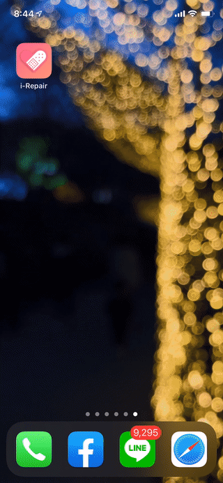

# hacknroll-irepair-frontend

## Notice
 - 1.0.0 is now released, it is recommended to reinstall the PWA App for best use experience

## Preview

## Description
This is a AWS Hack'n'Roll competition works

## Website

 - https://i-repair-11e98.firebaseapp.com/
 - https://i-repair.dailyofjames.com/

## how to install PWA on IOS
1. Open Safari on your iPhone.
2. Go to the website(e.g. scrum-poker.dailyofjames.com).
3. Tap the Share button on Safari.
3. Find by slide to the right “Add to Home Screen.”
5. Name and Tap it, then tap Add (top right).

## how to install PWA on Android
1. Open Chrome on your Android Mobile Device
2. Go to the website(e.g. scrum-poker.dailyofjames.com).
3. Tap Settings (Top right corner) on Chrome.
4. Slide down and tap “Add to Home Screen.”        
    
## Version
2019/12/01: v1.0.0    

## LICENSE
[MIT](LICENSE)
